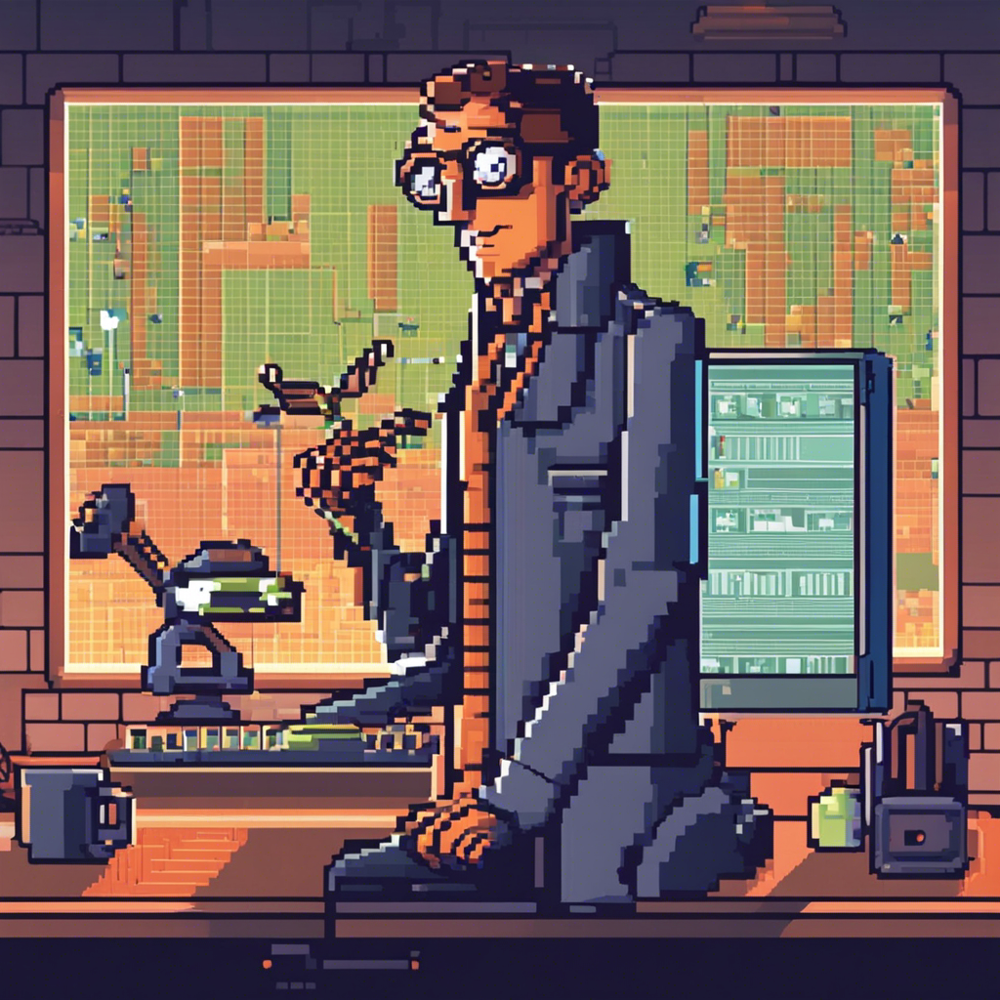

# Bob the Bug Hunter

Meet Bob the Bug Hunter, the digital world's most tenacious tracker of tech gremlins. Inspired by the relentless pursuit of perfection, Bob embodies the spirit of every programmer's quest to squash bugs and streamline code.

## Biography

Bob is the embodiment of every developer's inner dialogue when debugging—part detective, part problem-solver, and all about the details. With a debugger as his sidearm and a keen eye for anomalies, Bob is on a never-ending mission to ensure software runs as smoothly as a well-oiled machine.

### Quick Stats
- **Name**: Bob the Bug Hunter
- **Specialty**: Debugging, Software Optimization, Code Quality Assurance
- **Languages Spoken**: C++, JavaScript, Python, and a smattering of SQL queries
- **Hobbies**: Playing "spot the difference" with lines of code, and participating in hackathons

## Notable Contributions

Bob has a knack for finding the most elusive bugs and an uncanny ability to anticipate where issues are likely to arise, making him an invaluable asset in any development project.

### Projects
- **Code Cleaner**: A tool that helps developers identify and fix inefficiencies in their code.
- **Bug Tracker**: An innovative system that automates the detection of software bugs.

## Public Appearances

Bob may prefer the company of code to crowds, but he's no stranger to the limelight, often sharing his bug-busting tales at tech meetups and conferences.

### Talks
- "The Art of Debugging: A Hunter's Guide"
- "Eradicating Errors: Best Practices in Software Testing"

## In the Media

Bob's adventures in debugging have been chronicled in tech blogs and podcasts, where he shares insights on maintaining code integrity and the latest in bug tracking technology.

### Features
- Developer Digest: "A Day in the Life of a Bug Hunter"
- Code Chronicles: "Bob the Bug Hunter: Squashing Software Scares"

## Fun Facts

- Bob once fixed a bug so subtle, it was rumored to be a ghost in the machine.
- He's developed a personal metric for bug severity: the "Oh no!" scale.

## Connect with Bob

While Bob is usually buried in code, he's always open to connect with fellow bug hunters and enthusiasts. Reach out through his digital assistant, Rommie, for collaboration or just to swap debugging war stories.

---

Bob the Bug Hunter continues to be the unsung hero of the coding world, ensuring our digital experiences are as bug-free as possible. Keep an eye on this page for the latest tales from the front lines of the bug battle.
