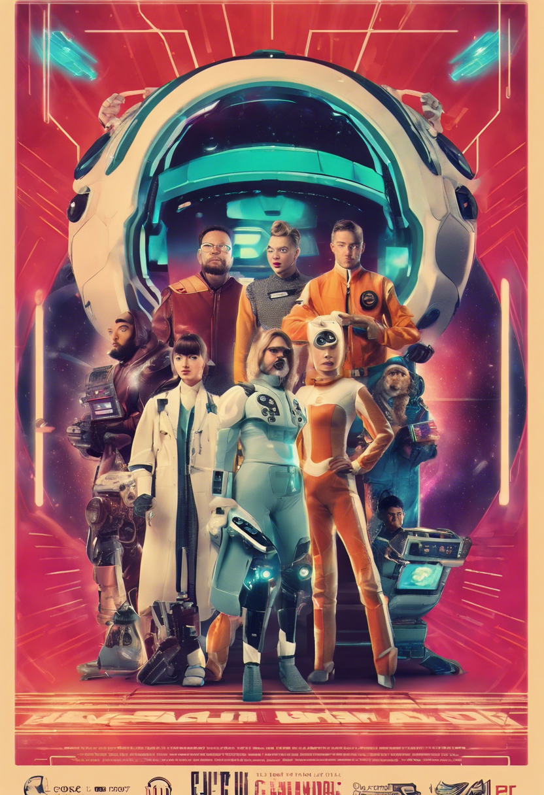

# Episode 1 Agenda - Year in Review 2023

Welcome to our special year-end episode where we look back at the tech highlights of 2023!

## Schedule

- **00:00 - 05:00 | Opening Monologue**
  - A byte-sized serving of tech humor to kick things off, reflecting on the twists and turns in the tech world over the past year.

- **05:01 - 15:00 | Tech Time Capsule**
  - _Featuring: Ada the Algorithm_
  - A look back at the tech predictions made at the start of the year and how they panned out, with Ada providing historical context and a touch of humor.

- **15:01 - 30:00 | Interview with a Legend**
  - _Featuring: Vince the Virtual Visionary_
  - A 'virtual' sit-down with a CGI representation of a tech pioneer, discussing their predictions for 2023 and the reality of those predictions.

- **30:01 - 40:00 | AI's Day Out**
  - _Featuring: Sally the Snarky Sysadmin_
  - A comedic skit where Sally reflects on the AI advancements and faux pas of 2023.

- **40:01 - 50:00 | The Nest's News Recap**
  - _Featuring: Bird Chuckly_
  - Bird Chuckly delivers the scoop on the biggest tech news stories of 2023 with a side of avian humor.

- **50:01 - 60:00 | Future Forecast**
  - _Featuring: Ivy the Innovator_
  - Ivy shares her thoughts on the tech trends that emerged in 2023 and what they might mean for the future.

- **60:01 - 70:00 | Tech Debate**
  - _Featuring: Bob the Bug Hunter & Chip the Chatbot_
  - A friendly yet fiery debate on the most controversial tech topics of 2023, moderated by our expert panelists.

- **70:01 - 75:00 | Closing Thoughts and Audience Q&A**
  - _Featuring: Wanda the Wise_
  - Wanda offers her final thoughts on the year's tech developments and answers questions from our live audience.

- **75:01 - 80:00 | The Lightning Round**
  - A rapid-fire Q&A session with all our panelists, revealing their unique and sometimes quirky tech perspectives on the year that was.

## Notes

- Ensure all panelists are prepped and ready 15 minutes before going live.
- Audience interaction is encouraged during the Q&A segment.
- Keep transitions between segments smooth and maintain a lively pace throughout the show.

---

That's all, folks! Tune in for a tech-tastic time as we bid farewell to 2023 and gear up for another year of innovation and excitement!
